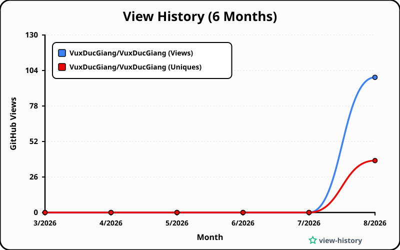

# 👁️ GitHub View History (`view-history`)

> **Theo dõi và lưu trữ lịch sử lượt xem (View Traffic) dài hạn cho GitHub Repository cá nhân của bạn, tự động vượt qua giới hạn 14 ngày của GitHub.**

---

## 🌟 Tính năng chính

- 📈 **Bỏ giới hạn 14 ngày của GitHub**: Tự động hợp nhất dữ liệu lượt xem hàng ngày và lưu trữ lịch sử dài hạn vào `data/history.json`.
- 🎨 **Tự động sinh biểu đồ SVG sắc nét**: Tạo file `charts/view-history.svg` với giao diện Dark Mode Glassmorphism cao cấp để nhúng trực tiếp vào `README.md`.
- 🤖 **Tự động hóa hoàn toàn với GitHub Actions**: Chạy định kỳ vào 00:00 UTC hàng ngày, tự lấy dữ liệu lượt xem mới nhất và commit vào repo.
- 💻 **Web Dashboard tương tác (Interactive Web App)**: Xem biểu đồ chi tiết dạng Daily Views hoặc Cumulative Growth, phân tích số lượng Unique Visitors.

---

## 🖼️ Biểu đồ SVG Nhúng Mẫu



---

## 🚀 Hướng dẫn Thiết lập & Sử dụng cho Repository của bạn

### 1. Tạo GitHub Personal Access Token (PAT)
GitHub Traffic API yêu cầu xác thực bằng Personal Access Token (PAT) có quyền đọc repository:

1. Truy cập [GitHub Developer Settings > Personal Access Tokens](https://github.com/settings/tokens).
2. Chọn **Tokens (classic)** hoặc **Fine-grained tokens**:
   - **Cách 1: Fine-grained tokens** (Khuyên dùng):
     * Chọn Repository của bạn (`Only select repositories` -> Chọn `view-history`).
     * Nhấp vào **+ Add permissions** bên dưới phần **Repository permissions**.
     * Tìm mục **Administration** -> Chọn quyền **Read-only**.
   - **Cách 2: Personal Access Tokens (Classic)**:
     * Tạo token mới và tích chọn scope **`public_repo`** (đối với repo công khai) hoặc **`repo`** (đối với repo riêng tư).
3. Copy mã Token vừa tạo.

### 2. Thêm Token vào Repository Secrets
1. Vào Repository `view-history` của bạn trên GitHub.
2. Chọn **Settings** > **Secrets and variables** > **Actions**.
3. Nhấp chọn **New repository secret**.
4. Điền tên Secret: `GH_PAT` và dán mã Token bạn vừa copy vào phần Value.
5. Nhấp **Add secret**.

### 3. Kích hoạt GitHub Actions
1. Chuyển sang tab **Actions** trên GitHub.
2. Nhấp chọn workflow **Update GitHub View History & Charts**.
3. Nhấp vào nút **Run workflow** để chạy thử lần đầu tiên.
4. Mỗi 00:00 UTC hàng ngày, GitHub Action sẽ tự động cập nhật lượt xem mới và vẽ lại biểu đồ `charts/view-history.svg`.

---

## 📌 Cách Nhúng Biểu đồ vào `README.md` của dự án khác

Chép đoạn mã Markdown sau vào file `README.md` của bất kỳ dự án nào của bạn:

```markdown
[](https://github.com/USERNAME/view-history)
```

*(Thay `USERNAME` bằng tên tài khoản GitHub của bạn)*

---

## 🛠️ Chạy ứng dụng dưới Local (Development)

1. **Chạy script lấy lượt xem mới nhất:**
   ```bash
   GH_PAT="token_cua_ban" TARGET_REPO="tên_user/tên_repo" npm run fetch-views
   ```

2. **Chạy script sinh biểu đồ SVG:**
   ```bash
   npm run generate-svg
   ```

3. **Mở Web Dashboard:**
   Mở file `index.html` trực tiếp trên trình duyệt hoặc chạy dev server (như Live Server, Vite, npx serve) để trải nghiệm giao diện tương tác.

---

## 📄 Giấy phép (License)
Dự án được phát hành dưới giấy phép [MIT License](LICENSE).
